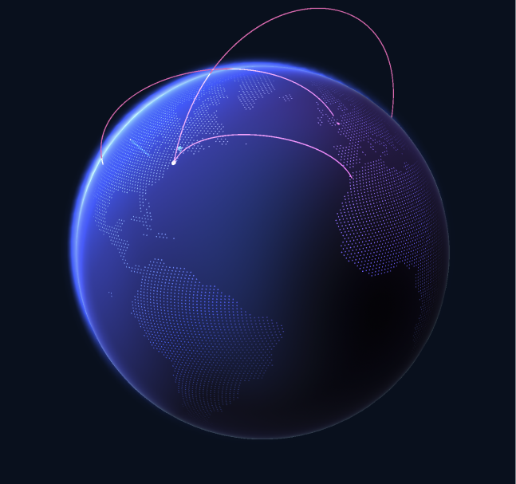

# Slack Real-time Globe

See it in action: https://slack.samliu.dev/

> Note!! This is very jank code scrapped together at 3am with the help of ai (Claude opus)

A real-time globe visualization of Slack activity. It receives data using undocumented Slack endpoints, estimates the location through timezones, to visualize it on a globe (original globe code by [GitHub](https://github.com/globe)).

> For privacy reasons, only publicly available activity is tracked.

